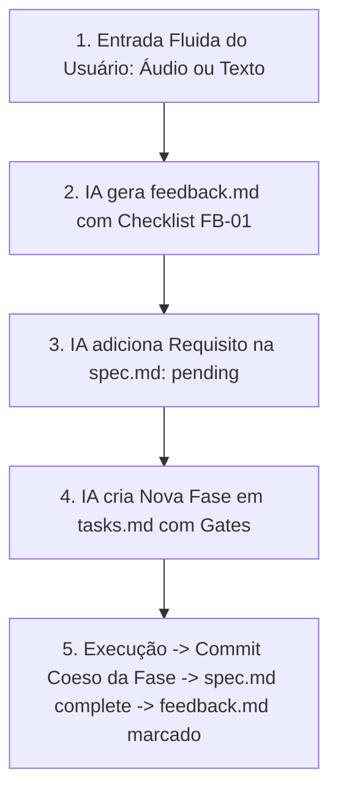

# Guia: UAT Feedback Loop & Homologação Humana

> **Objetivo:** Estabelecer o protocolo determinístico para captura de observações de homologação humana (UAT), conversão em novas fases de tarefas com rastreabilidade formal na `spec.md`, execução com commits coesos e fechamento auditável.

---

## 1. O Problema da Homologação Solta

Após o término da execução técnica e aprovação pelo Verifier automatizado, entra em cena o **Humano (PO / Lead / Usuário)** para testar no mundo real (celular, navegador, múltiplos cliques, cenários de borda).

Inevitavelmente, o teste humano revela refinamentos:
* Botões espremidos no mobile;
* Regras de status ou transição de dados para calibrar;
* Ajustes de contraste e cores.

Se o feedback for feito por mensagens soltas, a IA entra em modo "remendo": altera arquivos sem tasks formais, acumula dezenas de mudanças no Git e esquece de commitar.

O **UAT Feedback Loop do `k-sdd`** fecha essa lacuna.

---

## 2. O Ciclo de 5 Etapas do UAT



### Etapa 1: Entrada Fluida do Usuário
O usuário não precisa formatar nada. Ele pode:
* Gravar um áudio no microfone do chat;
* Digitar tópicos soltos no chat;
* Escrever livremente suas percepções de teste.

### Etapa 2: Estruturação do `feedback.md`
A IA cria (ou atualiza) o arquivo `.specs/features/[feature]/feedback.md` com caixas de seleção numeradas:

```markdown
# UAT Feedback: [Nome da Feature]

## Rodada 1 - [Data]
- **Entrada do Usuário:** [Texto ou transcrição de áudio]

### Checklist de Ajustes Solicitados
- [ ] **FB-01**: Alinhar botões de prazo lado a lado no mobile sem espremer -> *Task: T8*
- [ ] **FB-02**: Alterar status inicial de captura para 'novo' (não agendado) -> *Task: T9*
- [ ] **FB-03**: Documentar regra de transição de status no CRM -> *Task: T10*
```

### Etapa 3: Rastreabilidade na `spec.md`
A IA abre a `spec.md` da feature e adiciona os novos critérios de aceite derivados do feedback na tabela de **Requirement Traceability** com status inicial **`pending`**:
```markdown
| Requirement ID | User Story | Acceptance Criteria | Status |
| KANBAN-12 | US-02 | AC-KANBAN-12 | pending |
```

### Etapa 4: Nova Fase em `tasks.md`
A IA adiciona uma nova fase ao final do `tasks.md` com numeração contínua:
```markdown
### Phase 6: UAT Refinements & Fixes (Round 1)

#### T8: [Descrição da Correção]
**What**: [Ajuste específico]
**Where**: [Arquivo afetado]
**Depends on**: none
**Requirement**: KANBAN-12
**Done when**:
- [ ] [Condição de aceite observável]
- [ ] [npm run build com código 0]
**Gate**: Quick
```

### Etapa 5: Execução, Gates e Commit Coeso
1. A IA executa cada task da fase e valida seu Gate individual;
2. Ao concluir **todas as tasks da fase**, ela gera um **commit semântico coeso e robusto da Fase inteira**:
   ```bash
   git commit -m "fix(kanban): alinha layout mobile, ajusta status inicial e documenta ciclo"
   ```
3. A IA atualiza a `spec.md` para **`complete`**;
4. A IA marca **`[x]`** no item correspondente do `feedback.md`:
   ```markdown
   - [x] **FB-01**: Alinhar botões de prazo... -> *Resolvido em T8 (commit 8a9b0c)*
   - [x] **FB-02**: Alterar status inicial... -> *Resolvido em T9 (commit 8a9b0c)*
   ```
5. O script `validate_state.py` confirma que **nenhum item de feedback ficou pendente**.

---

## 3. Diretriz de Higiene de Contexto (Gerenciamento de Chats)

* **Durante a mesma Feature + UAT Feedback:** Mantenha o **MESMO CHAT**. A IA retém na memória recente o raciocínio dos arquivos recém-criados, permitindo ajustes cirúrgicos e instantâneos.
* **Ao Iniciar uma Nova Feature:** Abra um **NOVO CHAT**. Como o histórico da feature concluída já está persistido no Git, no `validation.md` e no `.specs/STATE.md`, o novo chat inicia com foco máximo, sem poluição de memória e com velocidade total.
* **Retomada de Sessão:** Caso uma sessão seja interrompida no meio do UAT, a IA lê o `feedback.md` e o `STATE.md` para continuar exatamente de onde parou.
